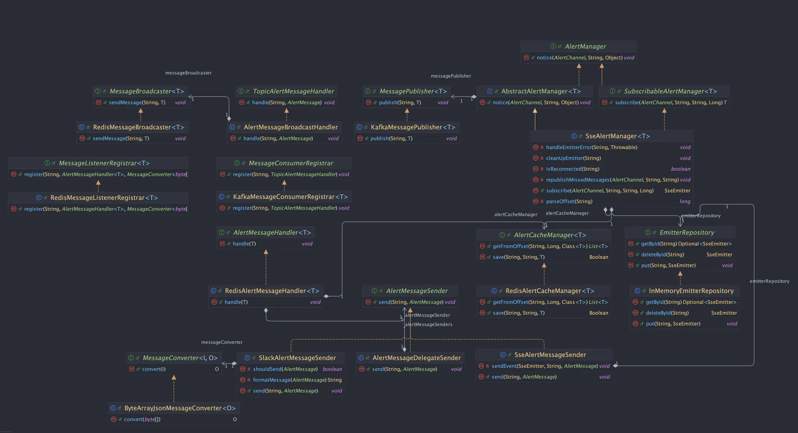
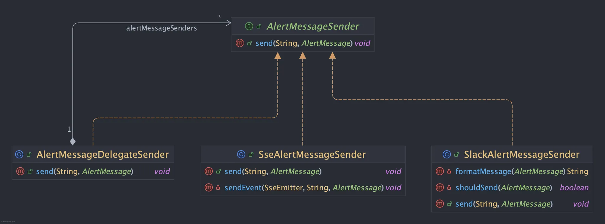

이 모듈은 **알림 기능**을 손쉽게 적용할 수 있도록 구성된 재사용 가능한 모듈입니다.

메시지는 publish되면 consumer에 의해 소비되고, 소비된 메시지는 `MessageBroadcaster`를 통해 구독 중인 모든 노드로 전파되며, 최종적으로 `AlertMessageSender`에 의해 다양한 채널로 전송됩니다.

이 과정은 발행 → 소비 → 브로드캐스트 → 전송의 4단계로, 각 컴포넌트는 인터페이스 기반으로 추상화되어 있어 브로커 종류(Kafka, RabbitMQ 등), 브로드캐스트 방식(Redis pub/sub 등), 전송 채널(Slack, Email, SSE 등)에 따라 쉽게 교체하거나 확장할 수 있습니다.

기본 구성은 Kafka + Redis를 사용하지만,

- `MessagePublisher`, `MessageConsumerRegistrar`를 교체하면 다른 메시지 브로커를 사용할 수 있고
- `MessageBroadcaster`, `MessageListenerRegistrar`를 교체하면 브로드캐스팅 방식도 변경할 수 있습니다.
- `AlertMessageSender` 구현체를 추가하면 Slack, Teams, Email, SMS, SSE 등 다양한 방식으로 메시지를 전송할 수 있습니다.

## AlertManager

사용자의 알림 발송 진입점입니다.

**AlertManager**

```java
public interface AlertManager {
    void notice(AlertChannel alertChannel, String targetId, Object message);
}
```

메시지를 발송 인터페이스를 정의합니다.

단순 전송을 담당하는 *AbstractAlertManager*가 있고, SSE와 같이 구독이 필요하다면 *SubscribableAlertManager*를 구현하여 *SseAlertManager*와 같이 사용할 수 있습니다.

**SubscribableAlertManager**

```java
public interface SubscribableAlertManager<T> extends AlertManager {
    T subscribe(AlertChannel alertChannel, String subscriberId, String lastEventId, Long timeoutMillis);
}
```

AlertManager를 상속받고 구독가능한 형태의 구현을 위한 인터페이스입니다.

**AbstractAlertManager**

메시지 payload를 받아 *AlertMessageFactory*를 통해 메시지를 생성하고 *MessagePublisher*를 통해 메시지를 발행합니다.

**AlertMessageFactory**

```java
public interface AlertMessageFactory<T extends AlertMessage> {

    T onConnect(String targetId);

    T onReplayMessage(String targetId, Object message);

    T onMessage(String targetId, Object message);
}
```

메시지 payload를 전달받아 AlertManager가 전송할 수 있는 형태의 메시지를 생성합니다.

**MessagePublisher**

메시지를 publish하는 역할로, Kafka, RabbitMQ 등을 사용하여 구현 가능합니다.

발행된 메시지는 *MessageConsumerRegistrar*을 통해 등록된 Consumer가 *TopicAlertMessageHandler*를 실행시키며 메시지가 처리 됩니다.

**MessageConsumerRegistrar, TopicAlertMessageHandler**

```java
public interface MessageConsumerRegistrar {
    void register(String topic, TopicAlertMessageHandler messageHandler);
}

@FunctionalInterface
public interface TopicAlertMessageHandler {
    void handle(String topic, AlertMessage message);
}
```

메시지를 소비할 컨슈머를 빈으로 등록합니다.

소비 시 어떤 동작을 할지는 *TopicAlertMessageHandler*가 정의합니다.

### SseAlertManager

메시지를 SSE를 기반으로 전달하는 *AlertManager*의 구현체 입니다.

구독 시 SseEmitter 객체 생성하고 *EmitterRepository*에 저장하며 클라이언트로 전달이 누락된 메시지는 캐시 매니저를 통해  가져와 재전송 해줄 수 있습니다.

## MessageBroadcaster

```java
@FunctionalInterface
public interface MessageBroadcaster<T> {
    void sendMessage(String topic, T message);
}
```

*MessagePublisher*에 의해 발행된 메시지가 소비되며 *MessageBroadcaster*를 사용할 수 있습니다.

예를들어, *RedisMessageBroadcaster*인 경우 Redis에 메시지를 publish하고 등록된 *MessageListener*에 의해 *AlertMessageSender*를 통해 최종 전송할 수 있습니다.

## AlertMessageSender

AlertMessageSender는 다양하게 구현할 수 있습니다. 알림 모듈은 기본적으로 3가지의 구현체를 제공합니다.



**SseAlertMessageSender**

*AlertMessage*를 *SseEmitter*로 변환하여 클라이언트로 전달됩니다.

**SlackAlertMessageSender**

slack 채널을 통해 메시지를 전달합니다.

*MessageFormatter*를 구현하여 *AlertMessage*를 원하는 형태의 메시지로 포맷팅하여 전송할 수 있습니다.

**AlertMessageDelegateSender**

*AlertMessageSender* 리스트를 사용하여 각각의 sender를 통해 메시지를 전달합니다.

예시로, SSE전송과 Slack 알림을 함께 전송하고 싶을때 사용할 수 있습니다.

## AlertChannel, AlertMessage, AlertMessageType,

### **AlertChannel**

```java
public interface AlertChannel {
    String name();
}
```

전송할 메시지가 전송될 채널을 정의합니다.

Kafka라면 topic에 매핑될 수 있고, RabbitMQ 라면 큐 이름이 될 수 있습니다. 또는 *MessagePublisher* 구현체에서 자유롭게 활용 가능합니다.

**구현 예시**

```java
public enum DefaultAlertChannel implements AlertChannel {
    PAYMENT_RESULT
}
```

### AlertMessage

```java
public interface AlertMessage {
    AlertMessageType type();

    String targetId();

    Object body();

    boolean isReplay();
}

```

알림 모듈 내에서 사용되는 메시지 인터페이스로 메시지가 전달될 대상의 식별자, 메시지의 유형, 메시지 내용, 메시지 재전송 여부를 정의합니다.

**구현 예시**

```java
public record DefaultAlertMessage(String targetId, DefaultAlertMessageType type, Object body, boolean isReplay) implements AlertMessage {
}
```

### **AlertMessageType**

```java
public interface AlertMessageType {
    String type();

    boolean isCacheable();

    String toString();
}

```

메시지의 유형을 정의하고 *AlertCacheManager*가 메시지를 캐싱할지를 판단할 수 있는 인터페이스입니다.

**구현 예시**

```java
public enum DefaultAlertMessageType implements AlertMessageType {
    CONNECT("connect"),
    MESSAGE("message");

    private final String type;

    DefaultAlertMessageType(String type) {
        this.type = type;
    }

    @Override
    public String type() {
        return this.type;
    }

    @Override
    public boolean isCacheable() {
        return this == MESSAGE;
    }
}
```